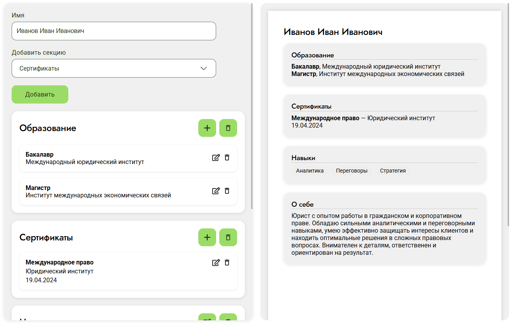

# Редактор резюме

## Установка и запуск

Для установки и запуска проекта необходимо выполнить команды
```
npm install
npm run dev
```
Открывается через порт http://localhost:5173

### Сборка

```
npm run build
```
Превью (запускать только после build)
```
npm run preview
```


